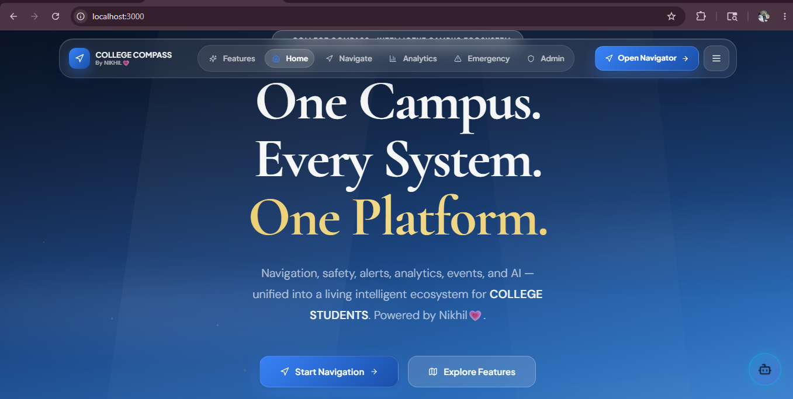
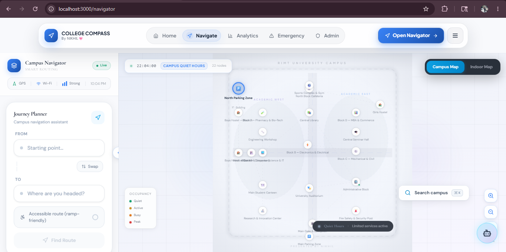
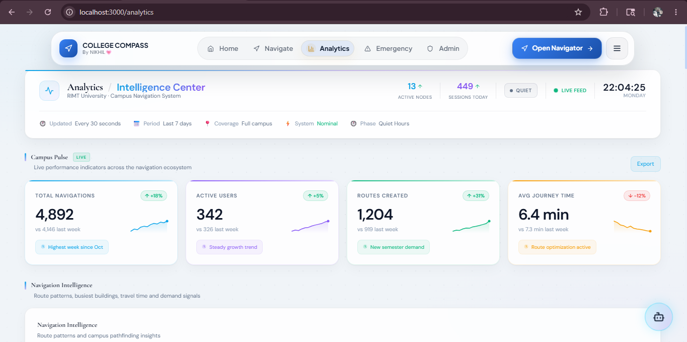
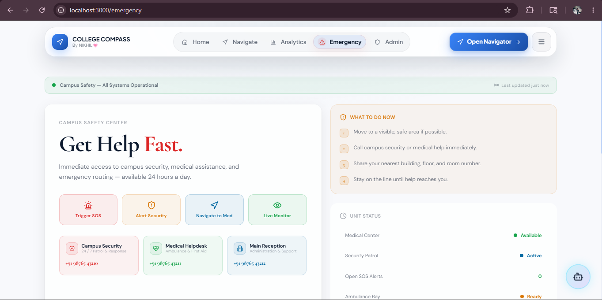
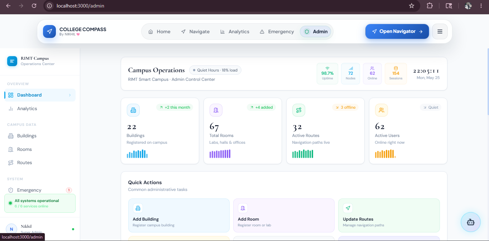

# Campus Compass

### India's Intelligent Campus Ecosystem

Campus Compass is a next-generation campus experience platform that combines smart navigation, indoor wayfinding, analytics, emergency response, campus operations, and AI-assisted guidance into a unified ecosystem.

Built using Next.js, TypeScript, Tailwind CSS, and Framer Motion, the platform aims to transform traditional campus navigation into an intelligent digital campus experience for students, faculty, administrators, and campus services.

---

## ✨ Overview

Campus Compass goes beyond navigation.

It provides an integrated experience that helps users:

- Navigate indoor and outdoor campus environments
- Find buildings, classrooms, offices, and facilities
- Access emergency assistance quickly
- Monitor campus activity and insights
- Manage campus operations through an administration console
- Interact with an AI-powered campus assistant

The long-term vision is to create a real-time intelligent campus platform capable of supporting navigation, operations, safety, analytics, and student productivity through a unified experience.

---

# 📸 Screenshots

## Landing Experience



---

## Smart Navigation



---

## Analytics Dashboard



---

## Emergency Center



---

## Admin Console



---

# 🚀 Core Features

## 🧭 Smart Navigation

- Interactive outdoor campus map
- Graph-based route generation
- Distance and walking-time estimation
- Wheelchair-accessible routing
- Building search and quick destinations
- Route progress controls
- Step-by-step navigation guidance
- Real-time navigation experience

---

## 🏢 Indoor Wayfinding

- Multi-floor navigation support
- Room-level routing
- Stair and elevator routing
- Floor switching
- Indoor route instructions
- Block A navigation system

---

## 📊 Campus Analytics

Monitor campus activity through:

- Usage metrics
- Route popularity analysis
- Traffic insights
- Location trends
- Navigation statistics
- Operational dashboards
- Campus activity intelligence

---

## 🚨 Emergency Response Center

Designed to improve campus safety through:

- Emergency contacts
- Security assistance
- Medical support locations
- Incident response guidance
- Campus safety workflows
- Live campus status monitoring

---

## ⚙️ Campus Operations Dashboard

Administrative tools include:

- Building management
- Room management
- Campus data workflows
- Operational insights
- Administrative controls
- Campus information management

---

## 🤖 AI Campus Assistant

Integrated AI assistant capable of:

- Campus-related guidance
- Navigation assistance
- Information retrieval
- Student support workflows
- General campus help

Powered through the `/api/chat` endpoint.

---

## ⌨️ Command Center

Global command palette for faster navigation:

- Quick destination search
- Building discovery
- Keyboard-first workflow
- Context-aware navigation actions
- Fast campus-wide access

---

# 🏗 Product Modules

| Module | Description |
|----------|----------|
| Landing Experience | Product introduction and ecosystem showcase |
| Navigator | Indoor and outdoor navigation experience |
| Campus Map | Interactive spatial campus visualization |
| Analytics | Campus intelligence dashboard |
| Emergency Center | Safety and response workflows |
| Admin Console | Campus operations management |
| Command Palette | Global navigation command center |
| AI Assistant | Conversational campus support |

---

# 🌐 Routes

| Route | Purpose |
|---------|---------|
| `/` | Landing experience |
| `/navigator` | Smart campus navigation |
| `/analytics` | Campus analytics dashboard |
| `/emergency` | Emergency response center |
| `/admin` | Campus operations dashboard |
| `/api/chat` | AI assistant endpoint |

---

# 🛠 Tech Stack

### Frontend

- Next.js (App Router)
- React
- TypeScript
- Tailwind CSS
- Framer Motion

### UI & Experience

- Glassmorphism Design System
- Responsive Layout Architecture
- Motion-Driven Interactions
- Modern Dashboard Interfaces
- Premium Navigation Experience

### AI Integration

- Google Gemini API (`@google/generative-ai`)
- AI Chat API

### Algorithms

- Dijkstra Pathfinding
- Indoor Routing Engine
- Multi-floor Navigation Logic

---

# 📁 Project Structure

```text
app/
├── page.tsx
├── layout.tsx
├── loading.tsx
├── navigator/
├── analytics/
├── emergency/
├── admin/
└── api/chat/

components/
├── map/
├── navigation/
├── admin/
├── chat/
├── layout/
└── ui/

data/
├── buildings.ts
└── floors.ts

lib/
├── dijkstra.ts
└── indoor-routing.ts

types/

docs/
└── screenshots/
```

# ⚡ Getting Started

Install dependencies:

```bash
npm install
```

Create `.env.local`

```env
GEMINI_API_KEY=your_api_key_here
```

Run the development server:

```bash
npm run dev
```

Open:

```text
http://localhost:3000
```

---

# 🔧 Useful Commands

```bash
npm run dev
npm run build
npm run start
npm run lint
npx tsc --noEmit
```

---

# 📌 Current Implementation Notes

- Indoor navigation currently supports Block A.
- Administrative workflows currently use local/demo state.
- Analytics, occupancy, operational status, and emergency activity panels currently display simulated/demo data.
- Emergency action controls and displayed contact numbers are demonstration-only and are not connected to response services.
- AI assistant requires a valid Gemini API key.
- Outdoor route times are calculated from campus path distances.
- Accessibility routing filters accessible edges within the campus graph.

---

# 🗺 Development Progress

## Phase 1 — Foundation ✅

Completed:

- Smart Navigation
- Indoor Navigation
- Campus Analytics
- Emergency Center
- Admin Console
- AI Assistant
- Command Palette
- Route Planning System

---

## Phase 2 — Product Maturity ✅

Completed:

- Premium Landing Experience
- Unified Design System
- Modern Campus Map Experience
- Polished Admin Dashboard Prototype
- Enhanced Analytics Center
- Emergency Operations Center
- Command Palette Improvements
- Global Navigation Architecture
- Modern Loading Experience
- Motion Design Refinements

---

## Phase 3 — Production Polish 🚧

Current Focus:

- Accessibility Improvements
- Performance Optimization
- Empty States
- Error States
- Skeleton Loading States
- Responsive Edge Cases
- Motion Consistency Audit
- Keyboard Navigation Enhancements

---

## Phase 4 — Intelligent Campus Layer 🔮

Planned Future Capabilities:

- AI Campus Guide
- Predictive Campus Insights
- Real-Time Campus Alerts
- Smart Crowd Intelligence
- Student Personalization
- Campus Recommendations
- Cross-Module Workflows
- Operational Decision Support
- Intelligent Wayfinding Suggestions

---

# 🎯 Vision

Campus Compass aims to become an intelligent campus ecosystem that unifies navigation, analytics, emergency response, campus operations, and AI-powered assistance into a single seamless platform.

The goal is not only to help users find locations, but to create a smarter, safer, and more connected campus experience.

---

# 👨‍💻 Author

**Nikhil Kumar**

Built with a vision of transforming traditional campus navigation into a modern intelligent campus ecosystem.

---

If you found this project interesting, feel free to explore the codebase, suggest improvements, or contribute ideas for future campus innovation.
